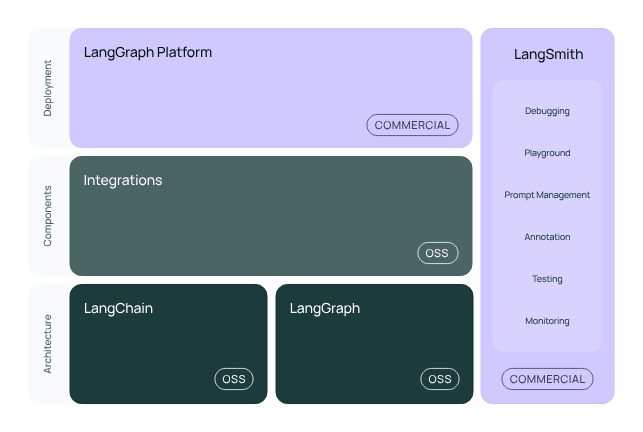

Weblink: https://ai.google.dev/gemini-api/docs/quickstart

# The LangChain framework consists of multiple open-source libraries. 

- langchain-core: Base abstractions for chat models and other components.
- Integration packages (e.g. langchain-openai, langchain-anthropic, etc.): Important integrations have been split into lightweight packages that are co-maintained by the LangChain team and the integration developers.
- langchain: Chains, agents, and retrieval strategies that make up an application's cognitive architecture.
- langchain-community: Third-party integrations that are community maintained.
- langgraph: Orchestration framework for combining LangChain components into production-ready applications with persistence, streaming, and other key features. 




# Gemini API Quickstart

This guide explains how to install the **Google GenAI SDK** and make your first request to the **Gemini API**.

---

## 1. Before You Begin

- You’ll need a **Gemini API key**.  
  Get it for free from **[Google AI Studio](https://aistudio.google.com/)**.
- Use **Python 3.9+** for the examples in this guide.

---

## 2. Install the Google GenAI SDK

Run the following in your terminal:

```bash
pip install -q -U google-genai
